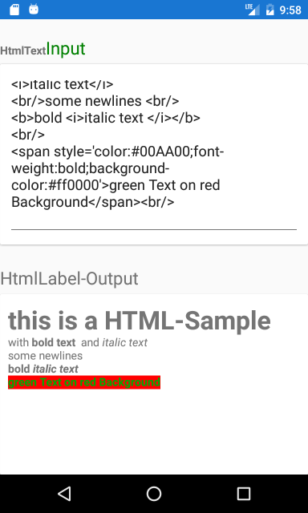
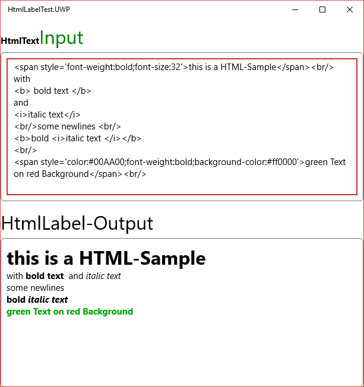
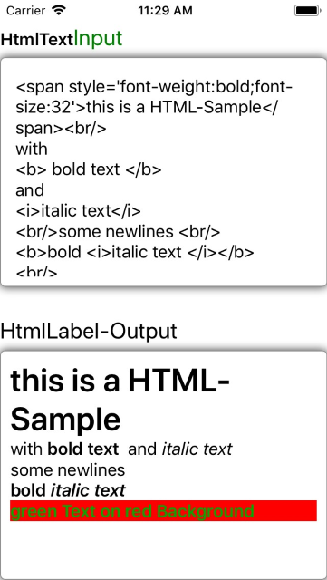

# MWX.XamForms.HtmlLabel
HtmlLabel an ultra lightweight implementation of converting html tags to Spans for an FormattedTextLabel.
The idea is to enable formatting for localized strings in ressource-files of an app.

The Html Label supports adding HtmlText with the small list of supported features of the FormattedString in Xamarin Forms.

In the Test Appplication you can check the support of the Tags because there are only small Feeaturelist.

Build State: 

**NuGet** 

The Control is available as NuGet Package MWX.XamForms.HtmlLabel here https://www.nuget.org/packages/MWX.XamForms.HtmlLabel/

Released: [](https://www.nuget.org/packages/MWX.XamForms.HtmlLabel/)


## Html-Label Properties

### HtmlText (string)
HtmlText to Display

### IgnoreNewlines (bool)
configures if newlines in the HTML-Text should stay there or not (default true -> ignore them).

## XAML Usage

simply add the XmlNamespace
```xaml
  xmlns:html="clr-namespace:MWX.XamForms.Controls;assembly=MWX.XamForms.HtmlLabel"
```
and then use it like a normal Label.
```xaml
  <html:HtmlLabel HtmlText="{Binding Text, Source={x:Reference htmlInput}}" />
```

## Screenshots
| Android | Windows | iOS |
| --- | --- | --- |
|  |  | 

## Supported Html-Tags

### \<span\>
inline container for "style"-Attributes.

### \<b\>
bold text

### \<i\>
italic text

### \<br\>
make a linebreak

## Supported 'style'-Attributes

### background-color
configure the BackgroundColor as HexNumber (not supported by Xamarin.Forms.Label by UWP)

### color
configure the Foreground-/Text-Color as HexNumber

### font-weight
supported values : bold, normal

### font-style
supported values : italic, normal

### font-family
configure the font family (Attention that is platform specific function)

### font-size
configure the font size (ignoring any em,pt or px unit given)

## final thoughts and who i am 


<div>

I will try to add more features soon and add more HTML-Tag-Support (Headlines and perhaps Lists) - but for the moment thats enough. ;)
if you've any ideas, comment, whatever please conact me <a href="mailto:office@marekworks.at">email.</a>
And if you want more information about me look at my website <a href="https://marekworks.at">Marekworks.at</a>
</div>

